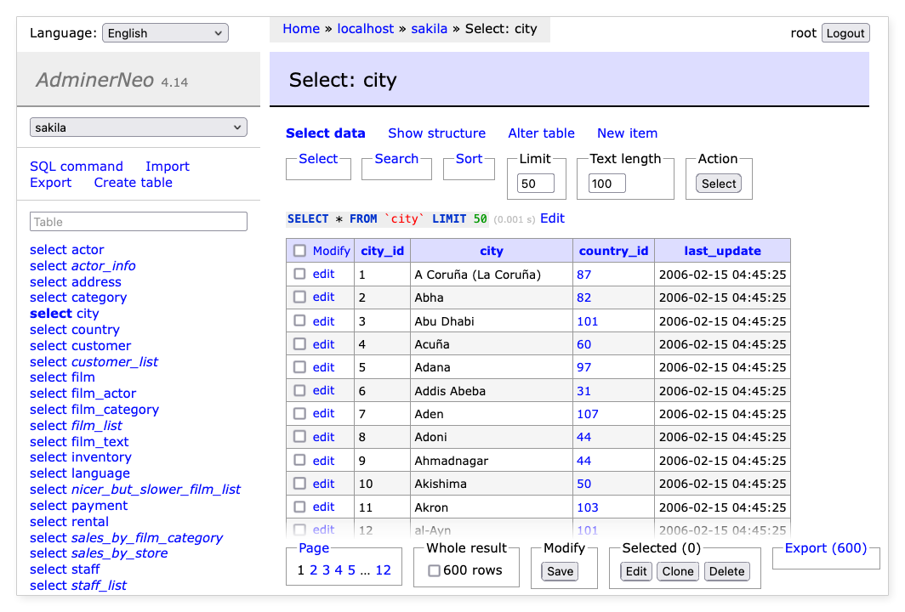

AdminNeo
==========

**AdminNeo** is a full-featured database management tool written in PHP. It consists of a single file ready to deploy 
to the target server. As a companion, **EditorNeo** offers data manipulation for end-users. 

Supported database drivers:
- MySQL, MariaDB, PostgreSQL, SQLite, MS SQL, Oracle, MongoDB
- With plugin: SimpleDB, Elasticsearch (beta), Firebird (alpha), ClickHouse (alpha)

AdminNeo is based on the [Adminer](https://www.adminer.org/) project by Jakub Vrána.



Requirements
------------

- PHP 7.1+ with enabled sessions.

Security
--------

AdminNeo does not allow connecting to databases without a password, and it rate-limits connection attempts to protect
against brute force attacks. However, it is highly recommended to **restrict access to AdminNeo** 🔒 by whitelisting IP
addresses allowed to connect to it, by password protecting access in your web server, or by enabling security plugins
(e.g. to require an OTP).

Migration from older versions
-----------------------------

Version 5 has been significantly redesigned and refactored. Unfortunately, this has resulted in many changes that break
backward compatibility.

A complete list of changes can be found in the [Upgrade Guide](docs/upgrade.md).

Usage
-----

Download one for the latest [release files](https://github.com/adminneo-org/adminneo/releases), upload to the HTTP server 
with PHP and enjoy 😉 If you are not satisfied with any combination of the database driver and language, you can 
download the source code and compile your own AdminNeo:

- Download the source code.
- Run `composer install` to install dependencies.
- Run compile.php:

```shell
# AdminNeo
php compile.php <drivers> <languages>

# EditorNeo
php compile.php editor <drivers> <languages>
```

For example:
```shell
php compile.php pgsql cs
php compile.php mysql,pgsql en,de,cs,sk
```

[Available drivers](adminer/drivers), 
[languages](adminer/lang).

Configuration
-------------

You can define a configuration as a constructor parameter. Create `index.php` file implementing `create_adminer()` 
method that returns configured `Adminer` instance.

```php
<?php

use Adminer\Adminer;

function create_adminer(): Adminer 
{
    // Define configuration.
    $config = [
        "theme" => "default-green",
    ];
	
    return new Adminer($config);
}

// Include original Adminer.
include "adminer.php";
```

Available configuration parameters:

| Parameter             | Default value | Description                                                                                                                                         |
|-----------------------|---------------|-----------------------------------------------------------------------------------------------------------------------------------------------------|
| `theme`               | default       | Theme code. Available themes are: `default`, `default-green`, `default-red`. Please, be sure that the theme is compiled into the final single file. |
| `versionVerification` | true          | Whether verification of the new Adminer's version is enabled.                                                                                       |
| `hiddenDatabases`     | []            | List of databases to hide from the UI or a `__system` keyword to hide all system databases. Access to these databases is not restricted.            |
| `hiddenSchemas`       | []            | List of schemas to hide from the UI or a `__system` keyword to hide all system schemas. Access to these schemas is not restricted.                  |

Plugins
-------

AdminNeo functions can be changed or extended by plugins. Plugins are managed by `Pluginer` customization class. 

* Download `Pluginer.php` and plugins you want and place them into the `plugins` folder.
* Create `index.php` file implementing `create_adminer()` method that returns Pluginer instance.

File structure will be:

```
- plugins
    - drivers
        - elastic.php
    - Pluginer.php
    - dump-xml.php
    - tinymce.php
    - file-upload.php
    - ...
- adminer.php
- index.php
```

Index.php:

```php
<?php

use Adminer\Pluginer;

function create_adminer(): Pluginer
{
    // Required to run any plugin.
    include "plugins/Pluginer.php";
    
    // Include plugins.
    include "plugins/dump-xml.php";
    include "plugins/tinymce.php.php";
    include "plugins/file-upload.php";
    
    // Enable plugins.
    $plugins = [
        new AdminerDumpXml(),
        new AdminerTinymce(),
        new AdminerFileUpload("data/"),
        // ...
    ];
    
    // Enable extra drivers just by including them.
    include "plugins/drivers/elastic.php";
    
    // Define configuration.
    $config = [
        "theme" => "default-green",
    ];
    
    return new Pluginer($plugins, $config);
}

// Include AdminNeo or EditorNeo.
include "adminer.php";
```

[Available plugins](plugins).

Main project files
------------------

- adminer/index.php - Run development version of AdminNeo.
- editor/index.php - Run development version of EditorNeo.
- editor/example.php - Example Editor customization.
- adminer/plugins.php - Plugins demo.
- adminer/sqlite.php - Development version of AdminNeo with SQLite allowed.
- editor/sqlite.php - Development version of Editor with SQLite allowed.
- compile.php - Create a single file version.
- lang.php - Update translations.
- tests/katalon.html - Katalon Automation Recorder test suite.

What to expect
--------------

Our top priority is fixing the security issues and reported bugs. But we also want to move forward and transform
AdminNeo to a tool with clean modern UI and simple configuration.

### Version 4.x

Original design and backward compatibility is maintained. Many bugs have been fixed and several functional and 
UI improvements have been introduced.

### Version 5

Bridges are burned 🔥🔥🔥. Our goals are:

- **Requirements** - Bump minimal PHP to 7.1. 
- **Themes** – Brand-new default theme based on our old [Adminer theme](https://github.com/pematon/adminer-theme). It will support dark mode and configurable 
color variants for production/devel environment. All current designs will be removed. 
- **Plugins** - Integrate several basic plugins, enable them by simple optional configuration.
- **Codebase** - Prefer code readability before minimalism, use PER coding style, add a namespace.
- **Compilation** - Allow to export selected drivers, themes, languages and plugins into a single PHP file.
